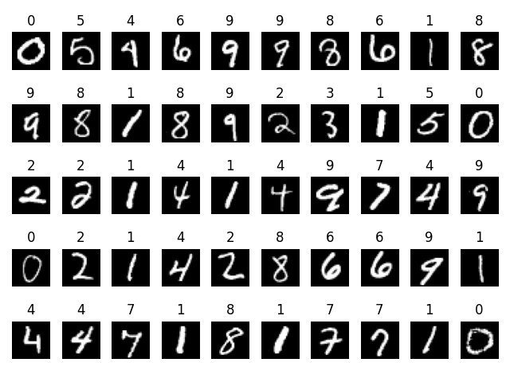

# 手写数字识别项目

## 项目概述
这是一个基于PyTorch的手写数字识别项目，利用MNIST数据集进行训练和测试。该项目实现了一个简单的全连接神经网络，旨在对手写数字进行分类。

```bash
预测: tensor([0, 5, 4, 6, 9, 9, 8, 6, 1, 8, 9, 8, 1, 8, 9, 2, 3, 1, 5, 0, 2, 2, 1, 4,
        1, 4, 9, 7, 4, 9, 0, 2, 1, 4, 2, 8, 6, 6, 9, 1, 4, 4, 7, 1, 8, 1, 7, 7,
        1, 0])
实际: tensor([0, 5, 4, 6, 9, 9, 8, 6, 1, 8, 9, 8, 1, 8, 9, 2, 3, 1, 5, 0, 2, 2, 1, 4,
        1, 4, 9, 7, 4, 9, 0, 2, 1, 4, 2, 8, 6, 6, 9, 1, 4, 4, 7, 1, 8, 1, 7, 7,
        1, 0])
准确率: 1.0
```
## 项目结构
```
.
├── README.md                  # 项目说明文档
├── base_model.py              # 定义神经网络模型的文件
├── data_test/                 # 测试数据集
│   ├── Figure_1.png
│   ├── Figure_2.png
│   └── MNIST/raw/            # 原始MNIST测试数据
│       ├── t10k-images-idx3-ubyte
│       ├── t10k-images-idx3-ubyte.gz
│       ├── t10k-labels-idx1-ubyte
│       ├── t10k-labels-idx1-ubyte.gz
│       ├── train-images-idx3-ubyte
│       ├── train-images-idx3-ubyte.gz
│       ├── train-labels-idx1-ubyte
│       └── train-labels-idx1-ubyte.gz
├── data_train/                # 训练数据集
│   ├── MNIST/raw/            # 原始MNIST训练数据
│       ├── t10k-images-idx3-ubyte
│       ├── t10k-images-idx3-ubyte.gz
│       ├── t10k-labels-idx1-ubyte
│       ├── t10k-labels-idx1-ubyte.gz
│       ├── train-images-idx3-ubyte
│       ├── train-images-idx3-ubyte.gz
│       ├── train-labels-idx1-ubyte
│       └── train-labels-idx1-ubyte.gz
├── model/                     # 保存训练模型的目录
│   ├── numbermodel_7_0.976_20241012203328.pth
│   └── numbermodel_9_0.9757_20241012211743.pth
└── model_test.py              # 用于测试模型的脚本
```

## 安装依赖
请确保你已安装以下Python库：
- torch
- torchvision
- matplotlib

你可以使用以下命令安装依赖项：
```bash
pip install -r requirements.txt
```

## 使用方法

1. **模型训练**
   在 `model_train.py` 文件中，初始化模型、加载训练数据并开始训练。训练过程中，模型的准确率会被打印出来，并在达到设定的阈值时保存模型。

   ```python
   # 开始训练
   python model_train.py
   ```

2. **模型测试**
   使用已保存的模型进行测试。在 `model_test.py` 文件中导入已保存的模型`numbermodel_7_0.976_20241012203328.pth` 预测结果

3. **可视化**
   你可以使用 `matplotlib` 在测试数据集上可视化预测结果。`model_test.py` 文件中包含了相关的可视化代码。


```

## 结果
训练过程中，模型会保存到 `model/` 目录中，文件名包含训练的轮次和准确率，便于后续使用和比较。

## 注意事项
- 请确保在训练模型时使用的Python版本与安装的库兼容。
- 本项目使用MNIST数据集，确保数据集在指定路径下可用。

## 许可证
此项目采用MIT许可证，具体信息请查阅许可证文件。
```
